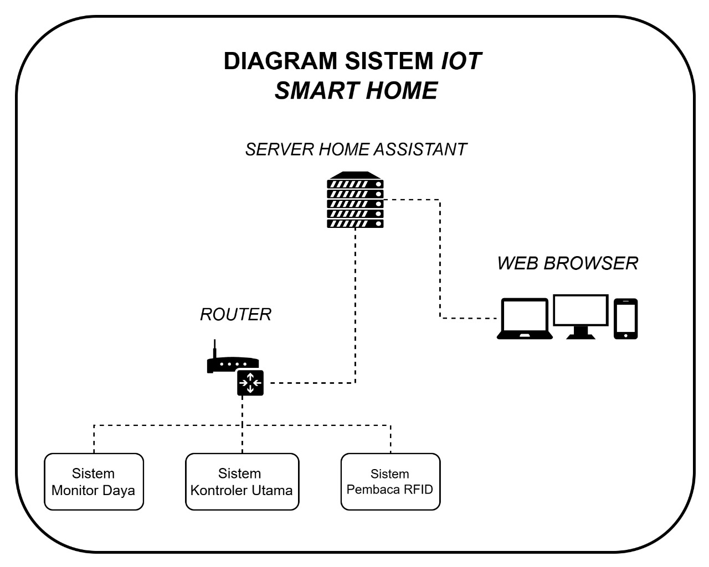
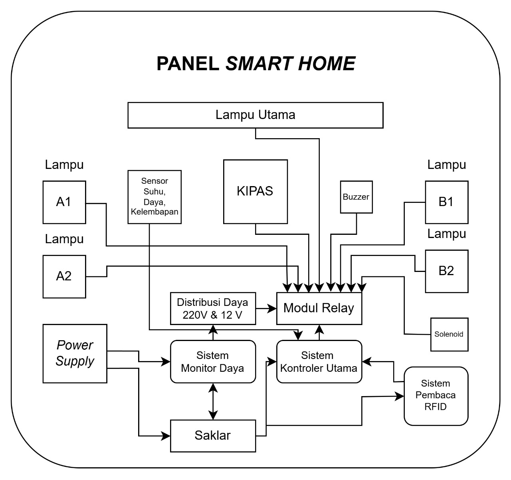
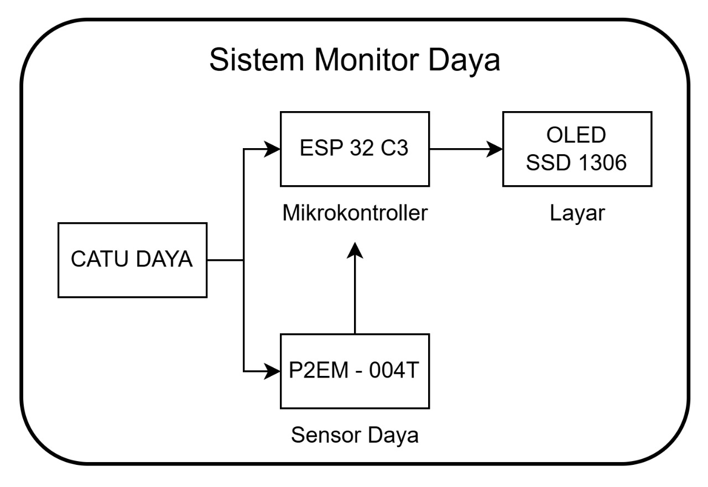
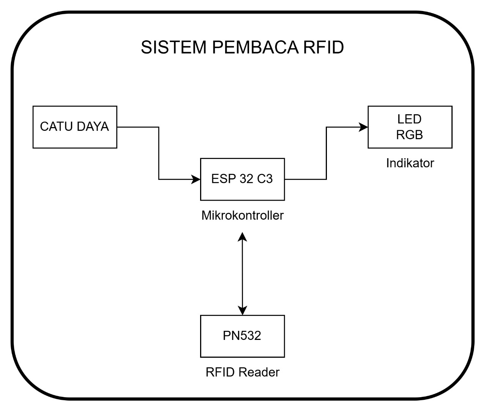
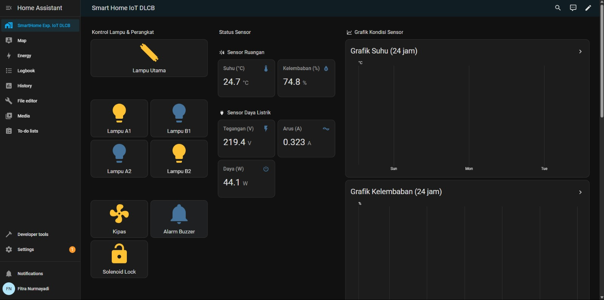
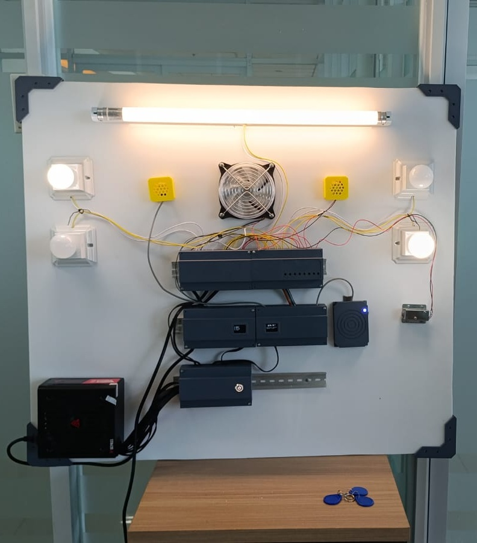

# IoT Smart Home Panel

## 🏠 Deskripsi Proyek

Proyek ini merupakan implementasi panel kontrol IoT bertemakan *Smart Home*, dikembangkan sebagai bagian dari konten pembelajaran berbasis Internet of Things (IoT). Sistem ini terdiri dari beberapa modul yang saling terintegrasi dan dikendalikan melalui *Home Assistant* pada Raspberry Pi 4.

## 🔧 Komponen Sistem

### 1. Sistem Kontrol Utama (ESP32-S3)

* Sensor DHT22
* Relay 8 Channel (kontrol 5 lampu: utama, A1, A2, B1, B2)
* Kipas, buzzer, dan solenoid
* OLED SSD1306

### 2. Sistem Monitoring Daya (ESP32-C3)

* Sensor daya PZEM-004T v3.0
* OLED SSD1306

### 3. Sistem Pembaca RFID (ESP32-C6)

* Modul RFID PN532
* LED RGB indikator akses

### 4. Server & Integrasi

* Raspberry Pi 4 + Home Assistant OS
* Integrasi melalui MQTT (dengan dukungan Auto-Discovery)

## 📂 Struktur Repositori

```
├── /ESP32S3_MAIN_CONTROL/       # Source code ESP32-S3 (kontrol utama)
├── /ESP32C3_POWER_MONITOR/      # Source code ESP32-C3 (monitoring daya)
├── /ESP32C6_RFID_READER/        # Source code ESP32-C6 (akses RFID)
├── /home-assistant/
│   ├── configuration.yaml       # Konfigurasi entitas
│   └── ui_lovelace.yaml         # Tampilan UI dashboard
├── /diagram/           # Gambar diagram sistem (placeholder)
└── README.md           # Dokumentasi proyek
```

## 📷 Dokumentasi Visual

Dokumentasi visual berikut berfungsi untuk memperjelas sistem yang telah dibangun, baik dari sisi fisik maupun logika diagram sistem.

### 📊 Diagram Sistem
- `diagram_sistem_iot.jpeg` – Diagram sistem IoT secara keseluruhan (hubungan antar perangkat via MQTT & Home Assistant)
- `diagram_panel_smarthome.jpeg` – Diagram wiring panel (ESP32-S3 ke relay, DHT22, OLED)
- `diagram_kontrol_utama.jpeg` – Diagram sistem ESP32-S3 (kontrol utama: lampu, kipas, buzzer, solenoid)
- `diagram_monitor_daya.jpeg` – Diagram sistem ESP32-C3 (pembacaan sensor daya dan pengiriman data ke Home Assistant)
- `diagram_rfid_akses.jpeg` – Diagram sistem ESP32-C6 (validasi UID RFID dan kontrol akses)

```md








```

### 🖼️ Dokumentasi Fisik
- `dashboard_smarthome.jpeg` – Tampilan antarmuka web di Home Assistant (UI Lovelace)

- `panel_smarthome.jpeg` – Foto fisik panel Smart Home (ESP32-S3, relay, sensor, dan wiring)

```md



```

## ✨ Fitur Unggulan

* Kendali perangkat melalui dashboard Home Assistant
* Monitoring suhu, kelembapan, dan daya secara real-time
* Sistem kontrol akses berbasis UID RFID
* Tampilan status pada OLED setiap modul
* Sinkronisasi melalui MQTT dengan struktur topik standar
* Dukungan penuh MQTT Auto-Discovery untuk Home Assistant

## ⚡ Teknologi yang Digunakan

* ESP32-S3, ESP32-C3, ESP32-C6
* Home Assistant + MQTT + YAML
* Sensor: DHT22, PZEM-004T, PN532
* UI Lovelace Dashboard

## 🎓 Lisensi

Proyek ini dibuat untuk keperluan pembelajaran. Silakan modifikasi sesuai kebutuhan.

---

> Dibuat oleh \[IoT DLCB PSI USU] • Mei 2025
